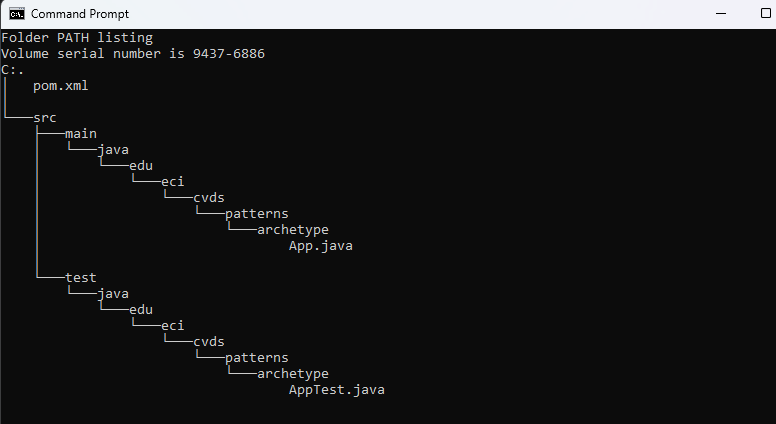

# Laboratorio 2

## Crear un proyecto en Maven 

## Compilar y ejecutar
### Busque cuál es el objetivo del parámetro "package" y qué otros parámetros se podrían enviar al comando `mvn`.

El objetivo de package es empaquetar un proyecto, por defecto se crea un .jar.

### Busque cómo ejecutar desde línea de comandos, un proyecto maven y verifique la salida cuando se ejecuta con la clase `App.java` como parámetro en "mainClass". 

### Ejecutar nuevamente la clase desde línea de comandos y verificar la salida: Hello World!

### Ejecutar la clase desde línea de comandos enviando su nombre como parámetro y verificar la salida. Ej: Hello Pepito!

### Ejecutar la clase con su nombre y apellido como parámetro. ¿Qué sucedió?
Se puso el nombre y apellido, pero como solo se esta imprimiendo la primera posicion del arreglo, solo se muestra el nombre sin el apellido

### Ejecutar nuevamente y verificar la salida en consola. Ej: Hello Pepito Perez!

## Hacer el esqueleto de la aplicación
### Analice y asegúrese de entender cada una de las instrucciones que se encuentran en todas las clases que se crearon anteriormente. 
### ¿Cuál fábrica hiciste? y ¿Cuál es mejor?

Creamos la fabrica Simple Factory porque solo había una interfaz, podíamos hacer un switch ya que no habían tantos objetos y por tanto no era necesario crear una fábrica abstracta.

Ejecute múltiples veces la clase ShapeMain, usando el plugin exec de maven con los siguientes parámetros y verifique la salida en consola para cada una:

Sin parámetros:

Parámetro: qwerty

Parámetro: pentagon

Parámetro: Hexagon

¿Cuál(es) de las anteriores instrucciones se ejecutan y funcionan correctamente y por qué?

Se ejecutan todas, pero la única válida es la última ya que por la enumeración solo se permite el parámetro Hexagon